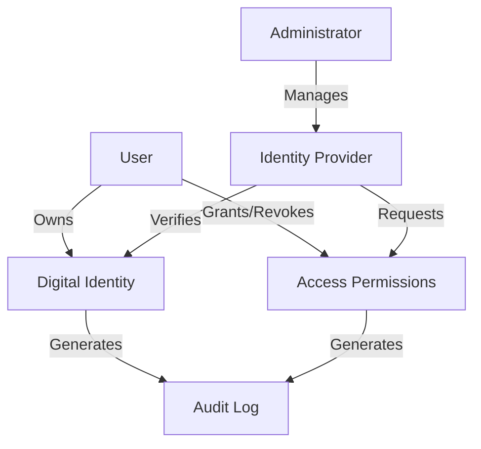

# Prefetch Pedersen: Decentralized Identity Management

A blockchain-powered identity verification platform that enables secure, sovereign digital identity management on the Stacks blockchain.

## Overview

Prefetch Pedersen is an innovative decentralized identity management system that provides users with complete control over their digital identity. By leveraging blockchain technology, the platform ensures privacy, security, and granular access control for personal identity attributes.

### Key Features

- User-controlled identity verification
- Decentralized identity provider registry
- Immutable audit trail of identity interactions
- Flexible permission settings with time-based access control
- Cryptographically secure attribute management
- Comprehensive identity interaction logging

## Architecture

The system revolves around a core smart contract managing user identities, permissions, and audit logging. The architecture implements a role-based access control model with three primary actors: users, identity providers, and administrators.



### Core Components

1. **Identity Management**
   - User registration
   - Identity provider verification
   - Account status tracking

2. **Permission System**
   - Granular identity attribute access
   - Time-limited permissions
   - Attribute-specific access control

3. **Audit Mechanism**
   - Comprehensive identity interaction logging
   - Access tracking
   - Modification history

## Contract Documentation

### Pedersen Identity Contract

The primary contract (`pedersen-identity.clar`) handles core identity management functionality:

#### Key Functions

**User Operations**
- Register user identity
- Grant identity access
- Revoke identity access

**Provider Operations**
- Register as identity provider
- Verify identity attributes
- Update identity information

**Administrative Operations**
- Verify identity providers
- Change contract administrator
- Manage system parameters

## Getting Started

### Prerequisites

- Clarinet CLI
- Stacks wallet
- Node.js development environment

### Installation

1. Clone the repository
```bash
git clone <repository-url>
cd prefetch-pedersen
```

2. Install dependencies
```bash
clarinet install
```

3. Run tests
```bash
clarinet test
```

## Security Considerations

### Access Control
- Explicit permission required for identity access
- Granular, time-limited permissions
- Providers must be verified

### Data Privacy
- Only identity attribute references stored on-chain
- Sensitive data encrypted off-chain
- Immediate and permanent access revocation

### Known Limitations
- Maximum 10 specific attributes per permission
- Manual identity provider verification
- No automated encryption mechanisms

## Contribution

Interested in contributing? Please read our contribution guidelines and code of conduct.